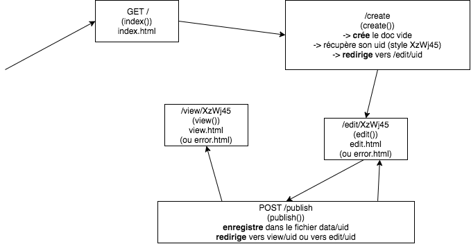

# Share Code Plus

Extension de Share Code : meta données, log utilisateurs, SQL, coloration de code

## Téléchargez et installez le code de base

Rappel: PyCharm, normalement, crée un venv dans chaque projet, vous pouvez
en créer indépendamment de PyCharm:
~~~~
$ cd /où/vous/voulez
$ python3 -m venv venv
$ source venv/bin/activate
c:\...> venv\Scripts\activate.bat
(venv) ... $ type python
/chemin/vers/votre/venv/bin/python
~~~~

Placez vous dans un venv actif (onglet "Terminal" de PyCharm ou n'importe
quel terminal système où vous avez activé un venv déjà créé par ailleurs).
~~~~
(venv) $ git clone https://framagit.org/jpython/share-code-plus.git
(venv) $ cd share-code-plus
(venv) $ pip install -r requirements.txt
(venv) $ python -m pip install -r requirements.txt # si la commande précédente ne marche pas
(venv) $ export FLASK_ENV=development
(venv) C:\...> set FLASK_ENV=development
(venv) $ python sharecode.py
~~~~

Ouvrez un navitageur et allez à l'url : http://localhost:5000/

Etudiez la structure de l'application : vues (sharecode.py) et modèle métier (model.py).

Notez que toute url qui déclenche un effet secondaire sur le serveur (écriture, création,
etc. de fichiers par exemple) se termine en redirigeant (Location: http://.../ailleurs dans
l'en-tête HTTP) vers une autre url.

# Atelier : améliorer l'application

Livrables : dans un dépôt GIT public (gitlab, github, framagit, ...) 

- Une documentation succinte mais claire au format _markdown_ (comme ce fichier)
- Scripts et modules Python modifiés et créés
- Gabarits HTML/CSS/JS 
- Les requètes SQL de création de tables (fichier `initdb.sql`)

## Partie 1 : enregistrer le langage de programmation utilisé

Ajouter une liste déroulante dans la page Web de création/modification d'un
bout de code pour choisir le langage de programmation utilisé parmi (par
exemple) : Python, C, PHP, JavaScript, etc. Le champ sera préselectionné
avec le langage précédemment enregistré si possible.

Enregistrez cette information lors de l'enregistrement du code dans un
fichier qui reprend l'id du code avec l'extension .lang (par example
si le code est dans `data/wMdWMbwAQ` on pourra trouver "Python" dans
`data/wMdWMbwAQ.lang`

## Partie 2 : Changez le procédé de stockage, plus de fichiers mais un SGBDR

Copiez `sharecode.py` sous le nom `sharecodedb.py` pour cette partie et la
suite.

Note : utilisez sqlite comme SGBDR (le connecteur est disponible en standard
avec Python 3, vous n'avez qu'à installer le client sqlite en ligne de commande
pour créer le schéma de la base). En production sur un vrai serveur Web
public on utiliserait plutôt PostgreSQL ou MariaDB/MySQL.

Concevez le schéma d'une base de données, constitué d'une seule table qui
stocke les extraits de code et le langage utilisé. Les vues de l'application
seront inchangées (hors appels aux fonctions métiers), seules les fonctions
ou classes du modèle métiers seront différentes.

Nommez le module qui implémente le modèle métier utilisant sqlite sous le
nom `model_sqlite.py` en vous inspirant du modèle `model.py`.

## Partie 3 : enregistrez les infos sur les utilisateurs qui publient du code

Ajoutez à la base une table pour enregistrer des informations sur les utilisateurs
qui publient du code (pas les lecteurs) : adresse ip, navigateur _(user agent)_,
date et heure de dernière modification.

Ajoutez dans le modèle métier l'enregistrement de ces informations (disponibles
à travers l'objet request construit par Flask).

Ajoutez une page accessible à travers /admin qui montre les extraits de code
publiés et ces informations concernant la dernière modification.

## Partie 4 : colorisation de code

Il existe un module Python pour colorer syntaxiquement du code : pygments.

Installez ce module, mettez à jour requirements.txt, utilisez le pour colorer
le code affiché par la page associée aux URLs de type `/view/.../` dans le bon
langage (celui enregistré en base de données).

## Partie optionnelle

- Pourrait-on détecter automatiquement le langage utilisé ? Comment ?
- Améliorez l'esthétique du site et son confort d'utilisation (grace à
  vos connaissance d'HTML 5, CSS et JavaScript). Le site doit pouvoir
  néanmoins être utilisable si JS est désactivé côté navigateur !
- Ajoutez une _black list_ des IP d'utilisateur en base, administrable
  par l'administrateur du site (ne vous occupez pas de l'authentification
  sur les pages d'admin, on peut configurer cela côté serveur Web de
  production -- Apache, NGINX, ...). Un utilisateur dont l'IP est dans
  cette liste se voit interdire l'accès en écriture au site.
- Développez un ensemble de vues pour accéder aux services de partage
  de code via une API REST sur des URLs de la forme : `/api/...`.
  Documentez cette API et fournissez un script (Python ou Shell) de
  test de l'API.

